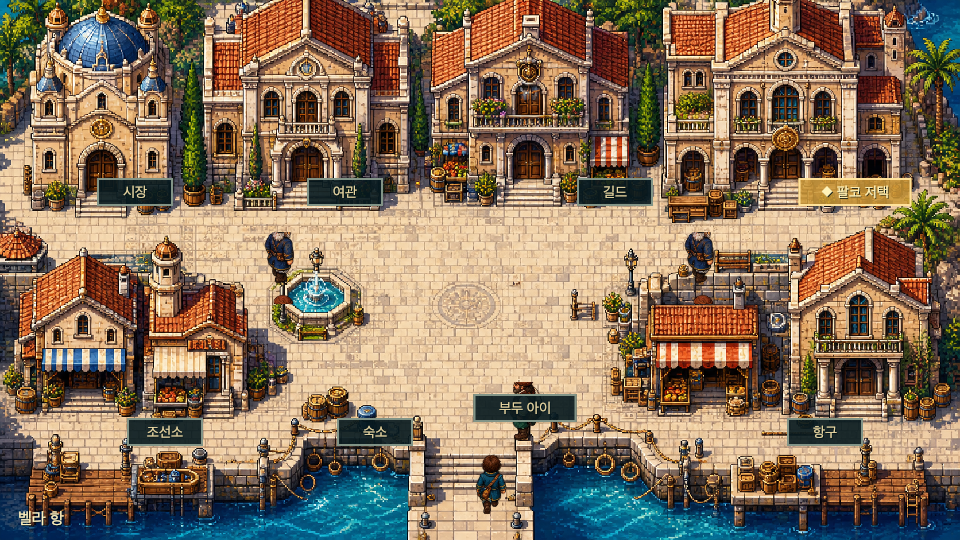
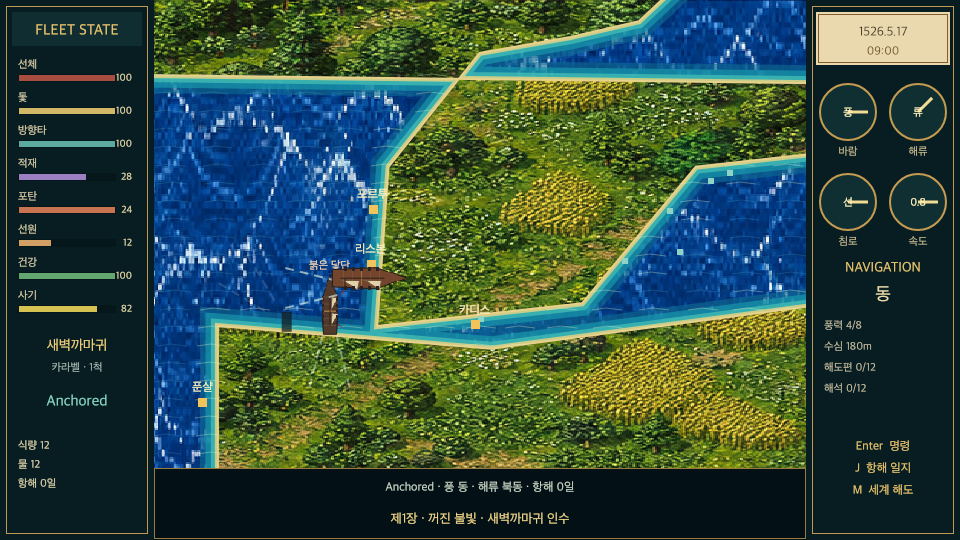
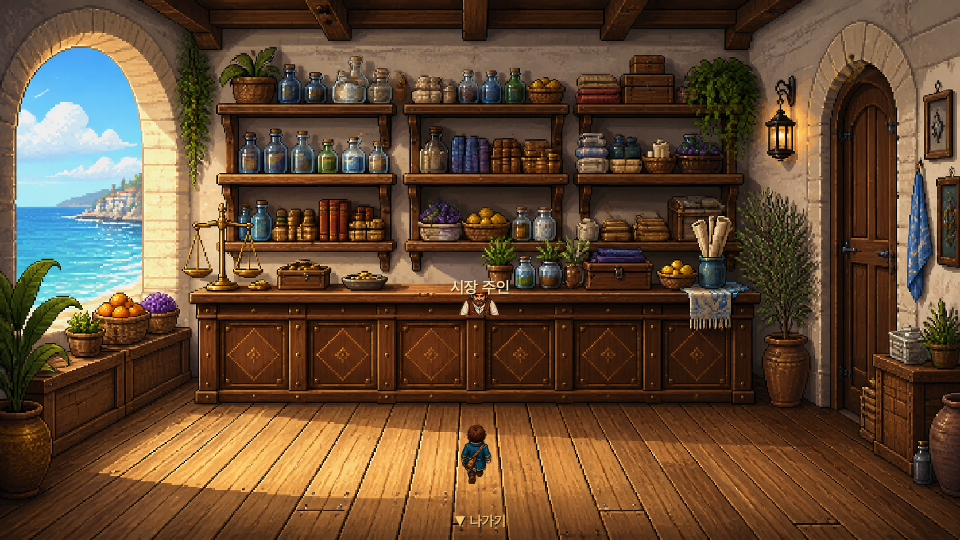

# 수평선의 여섯 항로

선장을 선택하고 항구 경제와 바람 항해, 사건을 따라 항로를 개척하는 게임.

[브라우저에서 플레이](https://seowooyoo2014.github.io/horizon-six-routes/) · [게임 방법](docs/gameplay.md) · [실행 방법](docs/running.md) · [아키텍처](docs/architecture.md) · [사용 기술](docs/technology.md) · [발전 히스토리](docs/history.md) · [검증](docs/verification.md) · [에셋](docs/assets.md)

## 화면

## 실행

웹판은 `python3 -m http.server 8000` 후 `/Web/`을 엽니다. Unity판은 Unity 2022.3.51f1에서 프로젝트를 열고 Play를 누릅니다.
