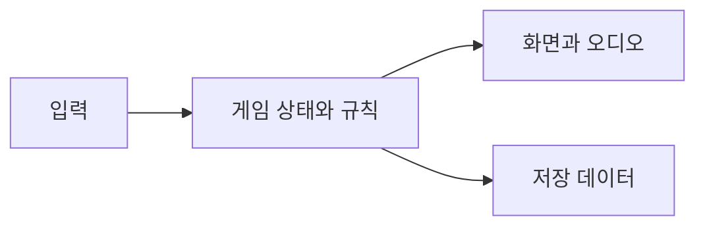

# 아키텍처

`Web/index.html`이 데이터·시스템·화면 스크립트를 순서대로 로드해 `HL.Game`을 시작합니다. 이미지·음향은 `Assets/Resources`에서 읽습니다. `Assets/Scripts/HorizonLedgerGame.cs`는 별도의 Unity 구현입니다.

```mermaid
flowchart LR
  I[입력] --> G[게임 상태와 규칙]
  G --> R[화면과 오디오]
  G --> S[저장 데이터]
```
